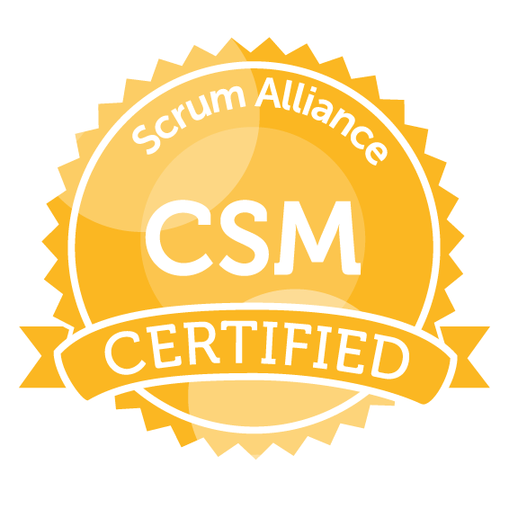
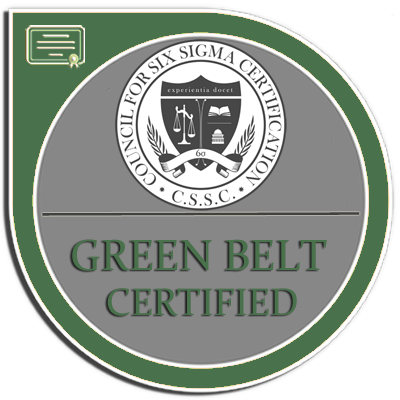
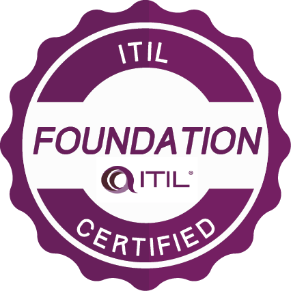
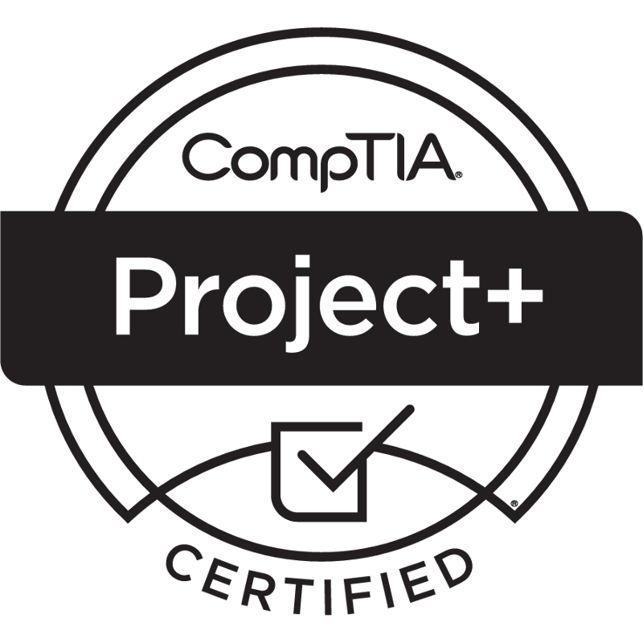
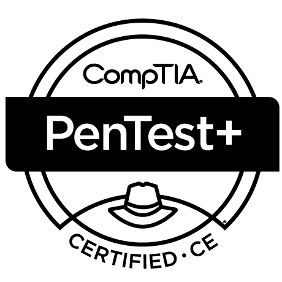
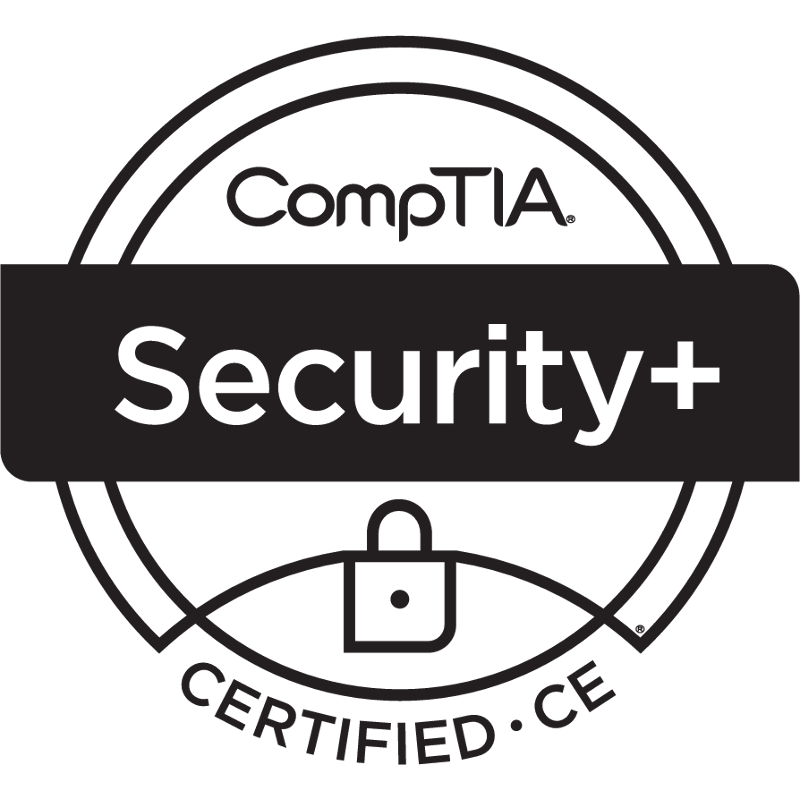
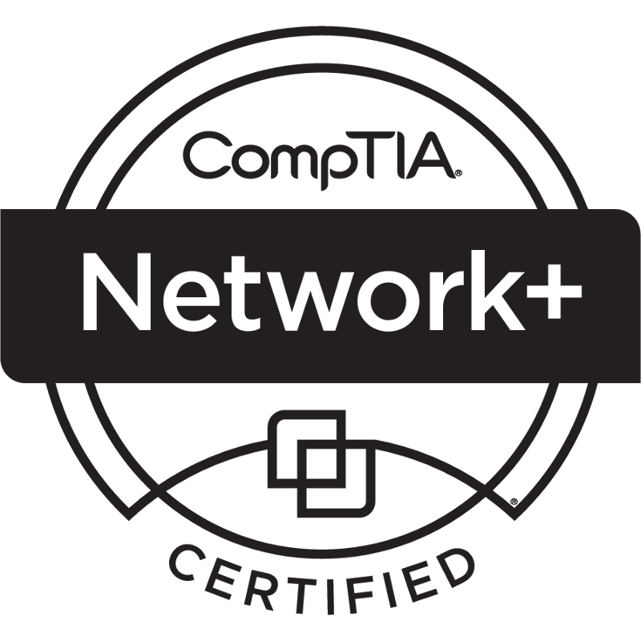

# 👋 Hi, I’m @tcgkubra

       

## Conditions I like to work in
- 🎵 I like to listen to music or real crime shows while working
- 🖥️ I like tools I can use from the command line
- 🚶 If I get stuck on a task, I like to walk and analyze the issue 

## Times / hours I like to work
- 🕛 8 AM - 4:30 PM Eastern Time
  - 🌞 Summer Hours: 8 AM - 5:30 PM Eastern Time  
- 🏠 I live in Altoona, Pennsylvania and we observe DST
 

## Best ways to communicate with me
- ✔️ Slack - @tgerlach - I have Slack on my phone
- ✔️ Video - Google Meet
- ✔️ Phone - 814.505.7430
- ✔️ JIRA/Confluence - @tgerlach
- ✔️ Email - thomas.gerlach@kubra.com
- ✖️ MS Teams - thomas.gerlach@hearst.com - I rarely check MS Teams
  - 🐧 I have used Unix-based systems for 30 years

## How I best recieve feedback
- 😀 I prefer face-to-face feedback - non-verbal communication is important
- ☎️ When face-to-face feedback is not an option, phone calls are better than chat 

## Things I need
- 💵 I like to understand the business drivers that impact requirements
- ❓ I'm okay with ambiguity, sometimes it's more effecient to move forward

## How I learn best
- 📖 I am an avid reader and life-long learner
- 🤹 I like to tinker with things and see how they work
- 📜 I am comfortable researching topics to get a better understanding

## I’m currently learning
- 👮‍♂️ I am studying for a PhD in Criminal Justice / Homeland Security
- 🇨🇳 I am working toward HSK-3 Chinese language certification
  - 你好！我学中文学了十年多了。
  - 我去过了香港和深圳了，很想回去看长城。
  - 如果你看不懂这个，你应该学中文。
  - 我的中文名字是张文山。
  - 我觉得中国文化很有意思。
- 💻 I am studying for the CompTIA CySA+ certification
- :atom: I am learning how to program quantum computers
- 🇯🇵 I recently started learning to speak Japanese
  
  
## Things I struggle with
- 📈 I set high standards for myself and expect the same from others
  - If my expections are too high, let me know so we can set appropriate expectations
- 🔥 I often play devils advocate when discussiong software requirements
  - I am not trying to argue with you, I want to make sure all perspectives are considered

## Things I love
- 🤖 Artificial Intelligence
- 🪐 Astronomy
- 💻 Computers
- 💬 Foreign Languages
- 🥷 Martial Arts
- 🧙 Medieval History
- 🎵 Music
- 👨‍👩‍👧‍👦 Social Sciences

## Other stuff
- 🖼️ I believe laptop stickers are an important part of individual expression
- 📜 I have an odd education which gives me a different perspective from many developers
  - 🕵️‍♂️ Doctor of Philosophy in Criminal Justice / Homeland Security (In Progress)
  - 📈 Master of Business Administration in Information Technology Management
  - 💻 Bachelor of Science in Software Development
  - 🧠 Associate of Science in Psychology
  - 💊 Certificate in Herbal Medicine
  - 🔑 Certificate in Locksmithing
  - 📻 Extensive Training in Radio Communications Systems
- 🎖️ I am a US Army Veteran
- 🎷 I am a musician and play multiple instruments
- 🥋 I have a third degree black belt in Taekwondo
- 📻 I am a ham radio operator
- 📄 I have numerous certifications
  - ☁️ AWS Certified Solutions Architect
  - 👨‍💼 Six Sigma Green Belt, Certified Scrum Master, ITIL
  - 💻 CompTIA A+, Network+, Security+, PenTest+, Project+
  - 👨‍🔬 CITI Program Responsible Conduct of Research, Human Subjects Research
  - 👨‍💻 CIW Advanced HTML5 and CSS Specialist, User Interface Designer

## Professional Memberships
- 👨‍👩‍👧‍👦 American Sociological Association
- 🧠 Association for the Advancement of Artificial Intelligence
- 🔌 Institute of Electrical and Electronics Engineers
- 🤖 IEEE Computational Intelligence Society
- 💻 IEEE Computer Society
 

## Learn more about me
- 🌎 Connect with me on [LinkedIn](https://linkedin.com/in/tcgerlach)
- 📖 See what [I'm currently reading](https://www.librarything.com/catalog/tcgerlach/currentlyreading)
